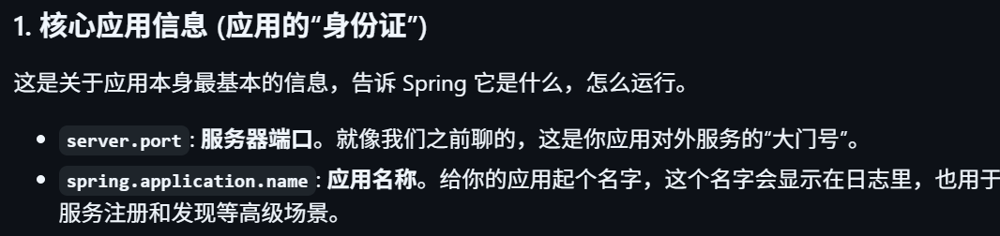
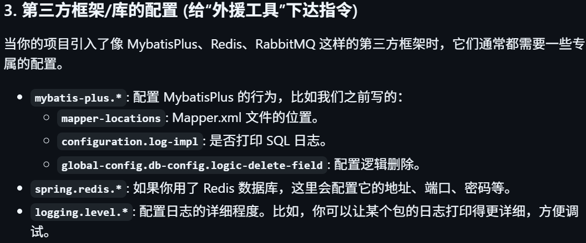

# 用户中心系统

## 引言

这是我走出新手村练的的第一个全栈项目，跟着鱼皮的视频敲，以下是我在敲这个项目时的收获

## Day 1

### 初始化项目

*初始化项目简单来说就是为项目搭建脚手架*

#### 前端初始化

- 使用**Ant Design Pro**作为现成的前端页面，跟着鱼皮把项目进行了瘦身(删除了不需要的配置)
- 前端的项目源代码在**WebStorm**中运行
- 配置了**Node.js**环境，Node.js是让JavaScript能在电脑里运行的环境，包含了一系列的命令行工具（npm，yarn，umi....），以后我们使用现成的前端页面(也叫做包,Package)都需要再依靠命令行操作来下载源代码
- **npm**和**yarn**是不同公司开发的包管理器(Package Manager)，帮助我们**下载，管理，运行**Package

#### 后端初始化

就是简单的java开发流程，我已经很熟悉了比如经典的SSM，这里就不多赘述了

**补充的知识：application.yml文件是springboot的设置文件，是用来存放项目配置信息的，比如数据库连接、端口号等的信息，主要的语法是键值对和缩进，键值对的冒号后面需要空格，用两个空格来表示缩进，以下是一般情况下yml文件要写的信息：**

