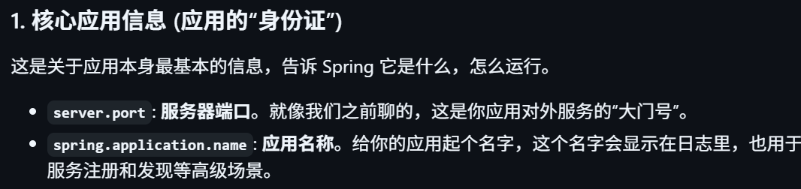
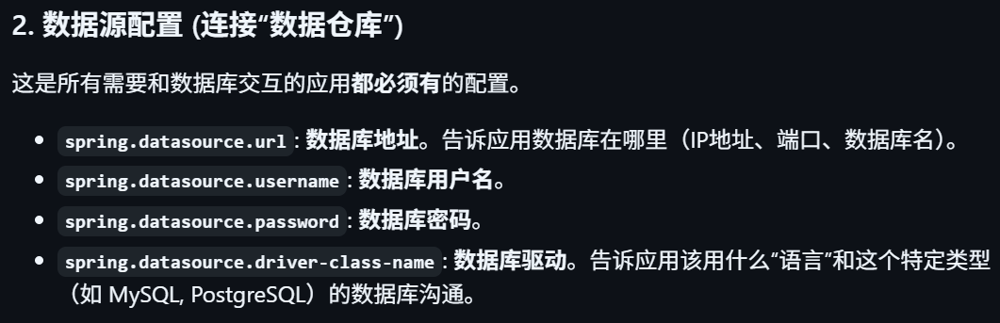
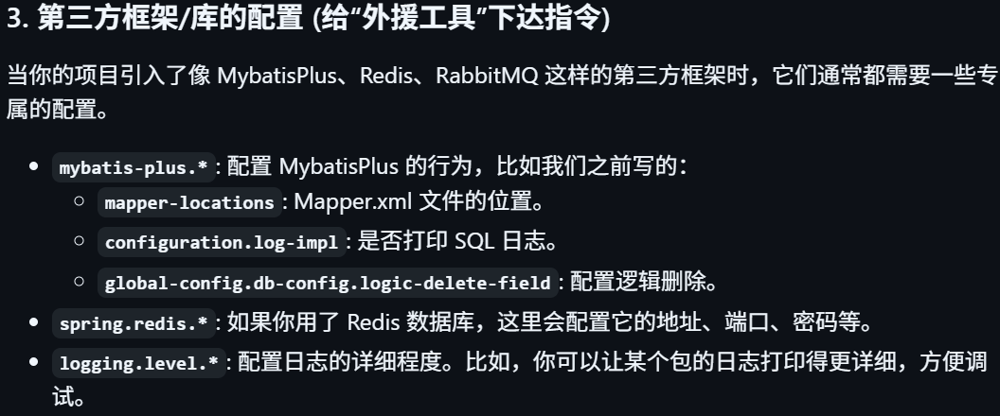

# 用户中心系统

## 1. 引言

这是我走出新手村练的的第一个全栈项目，跟着鱼皮的视频敲，以下是我在敲这个项目时的收获，完成时间为38天(2026.1.26~2026.3.4)，期间休息了一段时间，所以耽搁这么久

## 2. 项目系统设计

### 2.1. 架构设计

- 技术选型

> 前端：阿里Ant Design Pro生态，HTML + CSS + JavaScript三件套，React开发框架
>
> 后端：SSM三件套，Mybatis Plus 数据访问框架，MySQL数据库，Junit单元测试
>
> 部署：Linux单机部署，Nginx Web服务器，Docker容器，容器托管平台

### 2.2. 数据库设计

- 要设计哪些表？
- 表中有哪些字段？
- 字段的数据类型？
- 给字段添加索引？

> 这些都可以在IDE中快速构建

## 3. 项目初始化

> *初始化项目简单来说就是为项目搭建脚手架*

### 3.1. 前端初始化

- 使用**Ant Design Pro**作为现成的前端页面，跟着鱼皮把项目进行了瘦身(删除了不需要的配置)
- 前端的项目源代码在**WebStorm**中运行
- 配置了**Node.js**环境，Node.js是让JavaScript能在电脑里运行的环境，包含了一系列的命令行工具（npm，yarn，umi....），以后我们使用现成的前端页面(也叫做包,Package)都需要再依靠命令行操作来下载源代码
- **npm**和**yarn**是不同公司开发的包管理器(Package Manager)，帮助我们**下载，管理，运行**Package

### 3.2. 后端初始化

就是简单的java开发流程，我已经很熟悉了，比如经典的SSM，这里就不多赘述了

**补充的知识：application.yml文件是springboot的设置文件，是用来存放项目配置信息的，比如数据库连接、端口号等的信息，主要的语法是键值对和缩进，键值对的冒号后面需要空格，用两个空格来表示缩进，以下是一般情况下yml文件要写的信息：**







## 4. 后端开发

### 4.1. 用户注册

- 业务逻辑设计

> 1. 用户在前端输入账户、密码以及校验码
> 2. 校验用户的账户、密码以及校验码是否符合要求
>    1. 非空
>    2. 账户不小于4位
>    3. 密码不小于8位
>    4. 账户不能重复
>    5. 账户不能包含特殊字符
>    6. 密码和二次输入的密码相同
> 3. 对密码进行加密(密码千万不要以明文存储到数据库中)
> 4. 向数据库中插入用户数据

- 接口定义

> /user/register

- 代码实现说明

> 1. 所有的业务逻辑方法都写在Service层中的接口类，点击业务方法AIt + Enter实现方法就可以快速在接口的实现类中生成代码
> 2. 接下来就是在实现类中编写具体的代码，借助apache.commons-lang3依赖中的Utils减少编写的代码量，比如StringUtils.isAnyBlank判断是否有空值
> 3. Mybatis-Plus提供的QueryWrapper(条件构造器)，能让我们不用写复杂的SQL语句就能对数据库中的对象进行操作，可以帮助我们校验账户不重复，比如:
>
> ```java
> //        账户不能重复
> //        创建一个条件构造器
>         QueryWrapper<User> querywrapper = new QueryWrapper<>();
> //        为构造器添加条件
>         querywrapper.eq("account", userAccount);
> //        调用方法查询
>         long count = this.count(querywrapper);
>         if (count > 0) {
>             return -1L;
>         }
> ```
>
> 4. 使账户不包含特殊字符可以使用正则表达式（AI智能补全）
>
> 5. 对密码进行加密：
>
>    1. 引入Spring Security依赖
>    2. 创建一个专门的配置类，用于规定密码加密的相关配置
>
>    ```java
>    package com.bocao.usercenter.config;
>    
>    import org.springframework.context.annotation.Bean;
>    import org.springframework.context.annotation.Configuration;
>    import org.springframework.security.crypto.bcrypt.BCryptPasswordEncoder;
>    import org.springframework.security.crypto.password.PasswordEncoder;
>    
>    @Configuration
>    public class SecurityConfig {
>    
>        @Bean
>        public PasswordEncoder passwordEncoder() {
>            // 使用 BCrypt 算法，这是目前非常安全和流行的选择
>            return new BCryptPasswordEncoder();
>        }
>    }
>    ```
>
>    3. 在Service层中注入依赖，调用方法对密码进行加密

### 4.2. 用户登入

- 业务逻辑设计

> 1. 校验用户账户和密码是否合法
>
>    1. 非空
>    2. 账户不小于4位
>    3. 密码不小于8位
>    4. 账户不包含特殊字符
>
> 2. 校验密码是否输入正确，要和数据库中的密码去比对
>
> 3. 用户信息脱敏，隐藏敏感信息
>
> 4. 记录用户的登入态(session)，将其存到服务器上(用Springboot框架封装的服务器Tomcat去记录)
>
>    > 我们通过Session-Cookie机制让网站知道是哪个用户登入了
>    >
>    > Session记录用户是否登入的状态
>    >
>    > Cookie是已登入用户的身份牌
>
> 5. 返回用户信息

- 接口定义

> /user/login

- 代码实现说明

> 1. 前面几项校验和注册逻辑一样，直接复制粘贴
> 2. 区别在于要查询用户存在性和比对密码，若都符合就返回用户对象
>
> ```java
> // 4. 根据账户查询用户是否存在 (密码比对前，先查用户)
>         QueryWrapper<User> queryWrapper = new QueryWrapper<>();
>         queryWrapper.eq("account", userAccount);
>         User user = userMapper.selectOne(queryWrapper);
> 
> // 5. 如果用户不存在，直接返回错误
>         if (user == null) {
>             // 为了安全，通常不明确提示是“用户名不存在”还是“密码错误”
>             return null;
>         }
> 
> // 6. 用户存在，进行密码比对
>         String storedPassword = user.getPassword(); // 从数据库获取已加密的密码
> // 使用 passwordEncoder.matches() 进行比对
>         if (!passwordEncoder.matches(userPassword, storedPassword)) {
>             // 密码不匹配
>             return null;
>         }
> ```
>
> 3. 还要编写用户脱敏代码和登入态代码
>
> ```java
> //        用户脱敏
>         User safeUser = new User();
>         safeUser.setId(user.getId());
>         safeUser.setUsername(user.getUsername());
>         safeUser.setAccount(user.getAccount());
>         safeUser.setAvatarurl(user.getAvatarurl());
>         safeUser.setGender(user.getGender());
>         safeUser.setPhone(user.getPhone());
>         safeUser.setEmail(user.getEmail());
>         safeUser.setStatus(user.getStatus());
>         safeUser.setCreatetime(user.getCreatetime());
> //        记录用户的登入态
>         request.getSession().setAttribute(USER_LOGIN_STATE,safeUser);
> ```

### 4.3. 查询用户

- 设计业务逻辑

> 根据用户名进行查询，这个功能需要管理员权限，0为普通用户,1为管理员

- 接口定义

> /user/search

- 代码实现说明

> 其中要用到的方法有：
>
> request.getSession().getAttribute(用户登入态键)的作用是获取当前用户的状态 
>
> ```java
> /*
>    辅助方法:判断用户的管理员身份
>   */
>  private boolean isAdmin(HttpServletRequest request) {
>      //仅管理员可查询
>      Object userObj = request.getSession().getAttribute(USER_LOGIN_STATE);
>      User user = (User) userObj;
>      if (user == null || user.getRole() == NORMAL_USER_ROLE) {
>          return false;
>      }
>      return true;
>  }
> ```
>
> 
>
> queryWrapper.like("列名","要检索的字")进行**模糊搜索**
>
> userService.list(queryWrapper)根据条件，以列表的形式返回所有符合条件的数据

### 4.4. 删除用户

- 业务逻辑设计

> 根据用户ID进行删除，这个功能需要管理员权限，0为普通用户,1为管理员

- 接口定义

> /user/delete
>
> 补充知识：
>
> 程序的接口都写在Controller层,以下是Controller层常用的注解
>
> 使用@RestController注解编写restful风格的代码，返回值默认为JSON类型
>
> @RequestMapping相当于一个指示牌，在我需要调用的时候通过路径能精确找到我需要的接口，后面要添加路径
>
> @GetMapping,@PostMapping,@PutMapping,@DeleteMapping分别对应HTTP中的GET,POST,PUT,DELETE，后面要添加路径
>
> @RequestBody依据 DTO 这个类的定义，将前端发来的 JSON 数据 转换并封装 成一个全新的 DTO 对象实例
>
> 在编写代码时，我们需要传入对象，这时我们一般要构建一个**DTO对象**，它是定制版的User对象，它更加地安全有效，只包含我们想要的信息

- 代码实现说明

> request.getSession().getAttribute(用户登入态键)的作用是获取当前用户的状态 
>
> ```java
> /*
>    辅助方法:判断用户的管理员身份
>   */
>  private boolean isAdmin(HttpServletRequest request) {
>      //仅管理员可查询
>      Object userObj = request.getSession().getAttribute(USER_LOGIN_STATE);
>      User user = (User) userObj;
>      if (user == null || user.getRole() == NORMAL_USER_ROLE) {
>          return false;
>      }
>      return true;
>  }
> ```
>
> 在实体类的isdelete中添加@TableLogic，removeById就是逻辑删除了

## 5. 前端开发

> 对于要复用且不易改变的资源，我们可以创建一个constants常量包，里面存放着各种常量资源，比如logo

### 5.1. 登入功能

- 简化页面

主要就是删除不需要的代码同时把现成的代码修改为你想要的代码

> 这里有一些常用的快捷键：
>
> 1.Ctrl + Shift + F：全局搜索
>
> 2.Ctrl + 鼠标左键：查看源码

- 代理(Proxy)

> 正向代理：为客户端办事
>
> 反向代理：为服务器办事
>
> 二者都要经过代理服务器连接后端服务器

- 前后端交互

> 注意前端和后端的变量名要一致，后端叫啥名，前端就叫啥名
>
> 前端一般用ajax来请求后端，axios封装了ajax

> 真正实现前后端交互的地方是API文档，/api作为暗号让proxy配置文件里的代理，连接到后端，具体怎么连接后端就要在proxy配置文件里编写代码

> 结束进程：
>
> netstat -aon | findstr "8080"
> taskkill /F /PID 12345

### 5.2. 注册功能

> 注册功能可以通过复制粘贴登入功能快速开发

### 5.3. 结束

前端的开发到此为止，主要的问题都来自Ant Design Pro 这个现成的开发框架，它并不适用于目前开发的用户界面，而是适用于管理界面，再开发下去知识徒增时间

## 6. 项目部署

### 6.1. 多环境

多环境简单来说就是项目代码从开始到上线被分成了不同的阶段，每个阶段有不同的环境，一般有：

- 开发环境(dev)，程序员日常写代码、调试的环境
- 测试环境(test)，开发完成后交给测试人员验证功能、找bug的环境
- 生产环境(prod)，最终交给用户的环境，要求稳定性、安全性和性能

有关多环境的代码一般在配置文件里面

> 1. 主配置文件（application.yml）
> 2. 开发环境配置文件（application-dev.yml）
> 3. 测试环境配置文件（application-test.yml）
> 4. 生产环境配置文件（application-prod.yml）
>
> 开发时，想要哪个环境就在主配置文件加载哪个环境配置
>
> ```java
> profiles:
>         active: 后面写需要的环境
> ```
>
> 上线时，不用改配置文件，改变jar包的参数即可

### 6.2. 原始部署

什么都自己装

> 前端web服务器：nginx
>
> .......

### 6.3. 宝塔linux部署

。。。。。。

### 6.4. Docker部署

这是现在最主流的、最重要的部署方式

> Docker就是一个用于构建、运行、传送应用程序的平台

> 有关Docker的相关概念：
>
> - 镜像(images)是一个只读的模版，所有的容器都来自镜像
> - 容器(containers)是一个运行实例，相当于镜像的实现
> - 仓库(registry)是用来存储Docker镜像的地方，常见的有Dockerhub
> - 容器化(containerization)将应用程序打包成容器，并在容器中运行应用程序的过程
> - Dockerfile是一个文本文件，里面包含了各种指令，用来告诉Docker如何创建镜像

## 7. 结语

这是我的第一个项目实战，了解到了基本的**工程能力**，即分析问题、拆分问题、计划安排、规范编码等，但是这部分能力还有待提高
